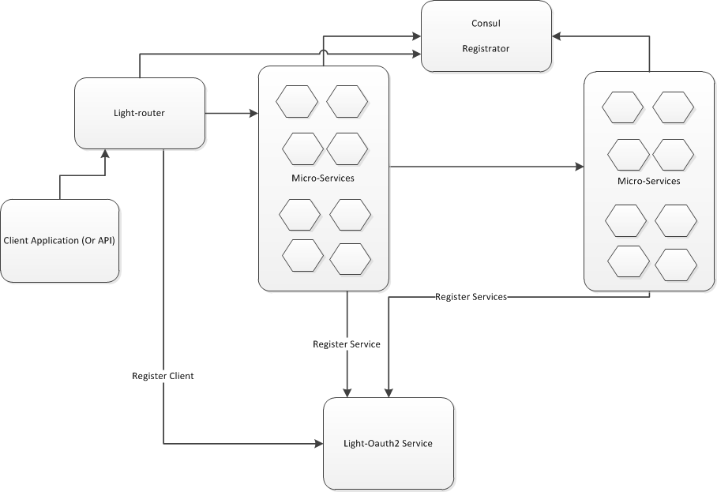

# light-router

A client-side service mesh router designed for the legacy system that cannot leverage the light-4j client module

[Stack Overflow](https://stackoverflow.com/questions/tagged/light-4j) |
[Google Group](https://groups.google.com/forum/#!forum/light-4j) |
[Gitter Chat](https://gitter.im/networknt/light-router) |
[Subreddit](https://www.reddit.com/r/lightapi/) |
[Youtube Channel](https://www.youtube.com/channel/UCHCRMWJVXw8iB7zKxF55Byw) |
[Documentation](https://doc.networknt.com/service/router/) |
[Contribution Guide](https://doc.networknt.com/contribute/) |

### Framework usage workflow diagram



### Light-router provides the Router Assisted Service Discovery


Light-router is a service that provides consumers with another option to make service discovery if they cannot leverage the client module provided by light-4j.

Light-router is primarily used for service discovery and technically there is client-side discovery only as it is called “service discovery” and only clients need to do that. All discovery can just exist on client-side.

The difference is that the discovery code in client or on the client host or on another static server in a data center. An additional scenario is to use light-router as BFF for SPA or Mobile.


### To learn how to use light-router, pleases refer to

* [Getting Started](https://www.networknt.com/getting-started/light-router/) to learn core concepts
* [Tutorial](https://www.networknt.com/tutorial/router/) with step by step guide for RESTful proxy
* [Configuration](https://www.networknt.com/service/router/configuration/) for different configurations based on your situations


### Sample on local environment

Start a sample API from light-example-4j:


```
 cd ~/networknt
 git clone git@github.com:networknt/light-example-4j.git
 cd ~/networknt/light-example-4j/servicemesher/services

 mvn clean install -Prelease

cd petstore-service-api

java -jar target/petstore-service-api-3.0.1.jar

```

The petstore light-api will start on local https 8443 port. 

verify by access the service directly on https://localhost:8443/

```
curl --location --request GET 'https://localhost:8443/v1/pets' \
--header 'Content-Type: application/json' \
--data-raw ''
```

Now start light-router and try to access the petstore light-api through light-router:

```
 cd ~/networknt
 git clone git@github.com:networknt/light-router.git

 mvn clean install
 java -jar -Dlight-4j-config-dir=config/local  target/light-router.jar

```

Verify through router handler by adding service_id in the header

```
curl --location --request POST 'https://localhost:9443/v1/pets' \
--header 'Content-Type: application/json' \
--header 'service_id: com.networknt.petstore-1.0.0' \
--data-raw '{"id":111, "name": "cat"}'

```

Verify through serviceDict handler and router handler by path mapping:

```

curl --location --request GET 'https://localhost:9443/v1/pets' \
--header 'Content-Type: application/json' \
--data-raw '{"accountId":1,"transactioType":"DEPOSIT","amount":20}'

```
 